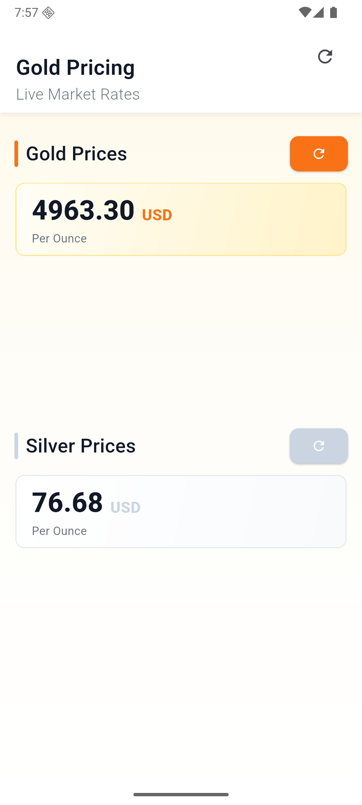
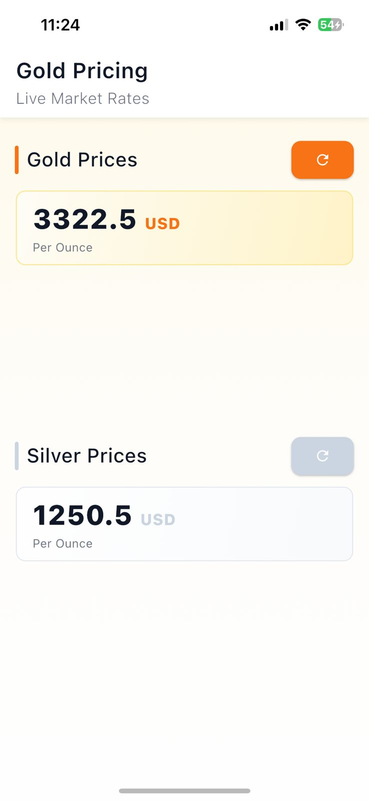
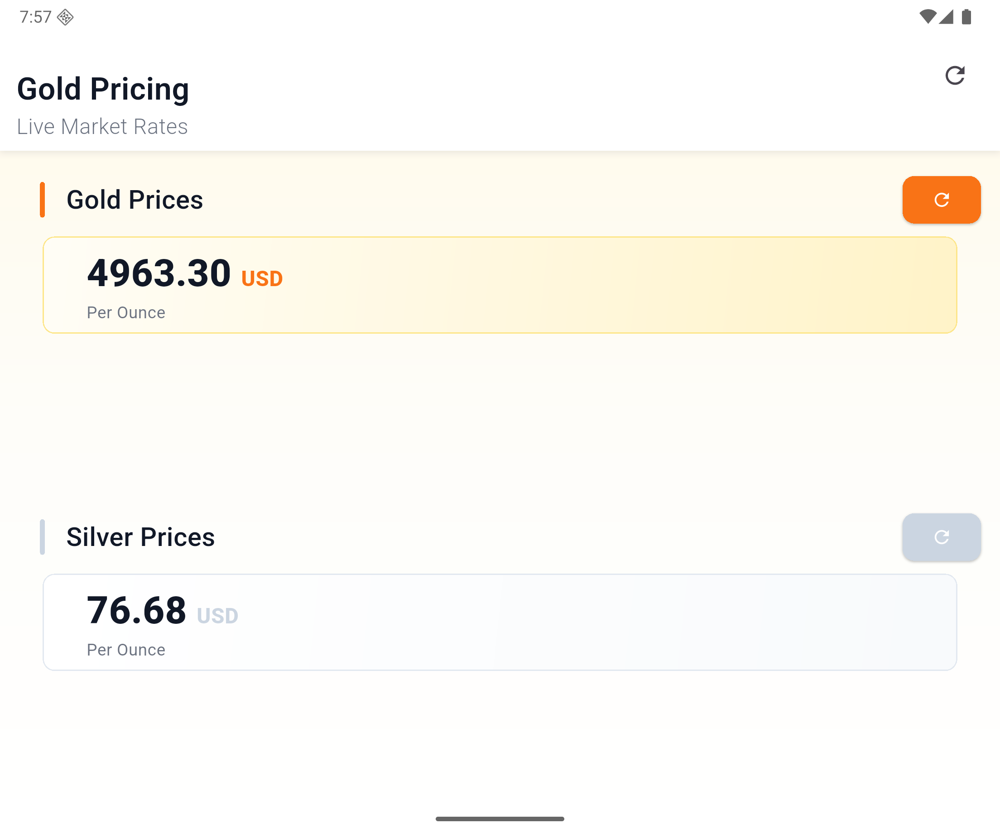
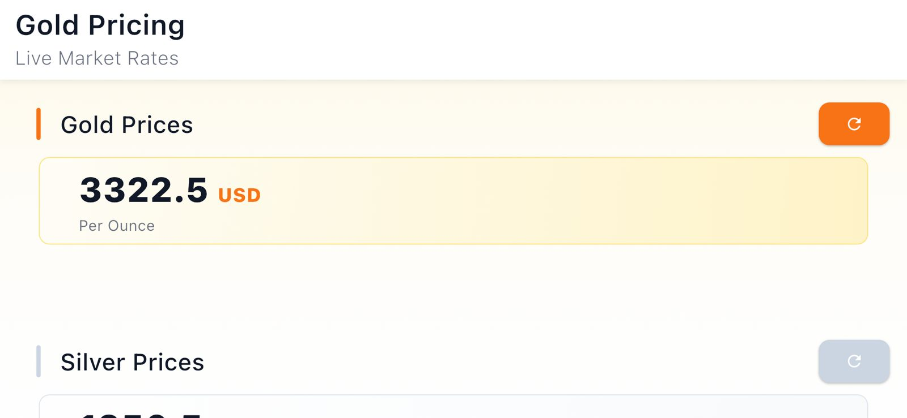

# 🪙 Gold Pricing App

A modern, responsive mobile application built with **Flutter** to track real-time **Gold and Silver prices**. This project was developed as part of a workshop focused on mastering the **MVVM architecture** and **State Management**.

---

## ✨ Features
* **Live Prices:** Real-time tracking for Gold and Silver.
* **Independent Refresh:** Refresh each metal price separately.
* **Global Sync:** Sync all data at once from the AppBar.
* **Modern UI:** Responsive design with Shimmer effect for better UX.
* **State Management:** Built using Flutter Bloc (Cubit) with MVVM architecture.
---
## 🏛️ Architecture (MVVM)
This project implements the **MVVM (Model-View-ViewModel)** pattern using **Flutter Bloc (Cubit)**:

- **Model:** Handles data logic and JSON serialization (`MetalModel`).
- **View:** UI layer that observes states and rebuilds accordingly (`HomeScreen`, `Header`).
- **ViewModel (Cubit):** Manages the business logic, API calls, and emits states to the View.

---

## 🛠️ Tech Stack
* **State Management:** Flutter Bloc (Cubit)
* **Networking:** Dio 
* **UI & Animation:** Shimmer, Flutter ScreenUtil
* **Architecture:** MVVM (Model-View-ViewModel)

## 📂 Project Structure
```text
lib/
 ├── core/              # Constants  
 (Colors, Strings, Styles)
 ├── feature/
 │   └── home/
 │       ├── data/      # Model & Repository (Data Layer)
 │       └── presentation/
 │           ├── logic/ # Cubit & States (ViewModel Layer)
 │           ├── home_screen.dart/ # UI Screens (View Layer)
 │           └── shared_widget.dart # Reusable UI components
```
### 📸 Device Previews
| Android | iPhone Portrait (last version) |
|:---:|:---:|
|  |  |

| Tablet | iPhone Landscape  (last version) |
|:---:|:---:|
|  |  |


## 📱 Loading Effects
<div align="center">
  
  <p><i>Shimmer loading effect</i></p>
</div>


---
## 🛠️ Tech Stack
* **Framework:** [Flutter](https://flutter.dev)
* **State Management:** [Flutter Bloc/Cubit](https://pub.dev/packages/flutter_bloc)
* **Responsive UI:** [Flutter ScreenUtil](https://pub.dev/packages/flutter_screenutil)
* **Animations:** [Shimmer](https://pub.dev/packages/shimmer)
* **Design Pattern:** MVVM (Model-View-ViewModel)
---
## 🚀 Getting Started

1. **Clone the repository:**
   ```bash
   git clone https://github.com/AhmedAyman/gold_pricing.git
   ```
2. **Install the dependencies:**
   ```bash
   flutter pub get
   ```
3. **Run the app:**
   ```bash
   flutter run
   ```

---

---

## 👨‍💻 Developed By
**Ahmed Ayman** | Flutter Developer[](https://ahmedayman-cv.vercel.app)

*Mastering Flutter & MVVM Architecture - Workshop Project*


## 📄 Contact
If you have any questions or suggestions, feel free to reach out to me:

* **Email:** [eng.ahmedayman.cv@gmail.com](mailto:eng.ahmedayman.cv@gmail.com)
* **LinkedIn:** [Ahmed Ayman](https://www.linkedin.com/in/ahmed-ayman-fathy/)

---

